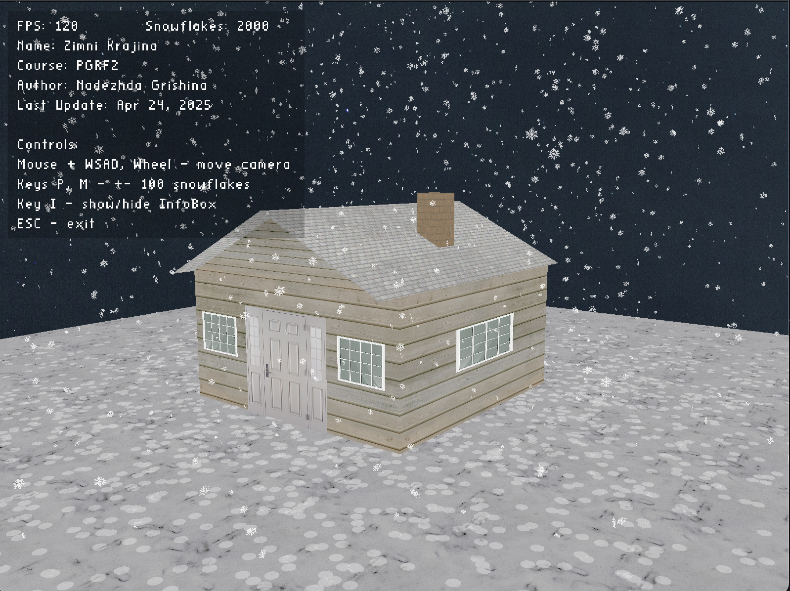

# Zimní krajina – Final Project for PGRF2

**Author**: Nadezhda Grishina  
**Course**: PGRF2  
**University**: University of Hradec Králové  
**Last Update**: April 24, 2025

---

## ❄️ Project Description

This semester project simulates a small **winter landscape** with a house and falling snow using Java and OpenGL (LWJGL).  
Snowflakes are animated with a simple particle system. When they reach the ground, they leave visible accumulation marks.  
The project includes textured 3D models, user interaction (mouse and keyboard), HUD display, and performance metrics (FPS counter).

---

## 🧩 Technologies Used

- Java 21
- OpenGL (via LWJGL 3)
- STB EasyFont (text rendering)
- IntelliJ IDEA
- macOS for development (also works on Windows/Linux)

---

## 📦 Project Contents

- `src/` – Source code (Java)
- `textures/` – All used texture files
- `out/artifacts/project-pgrf2.jar` – Executable fat JAR (macOS only)
- `mac-run.sh` – Shell script for easy macOS launch
- `used_sources.txt` – List of external resources used
- `README.md` – This file

---

## 🚀 How to Run

This package contains both **source code** and a precompiled **JAR file for macOS**.

---

### 🛠 Requirements

- Java 21
- IntelliJ IDEA (recommended for building from source)
- LWJGL 3 (included in JAR, required manually if running from source)

---

### ▶️ Run the JAR on macOS

Use the shell script:

```bash
./mac-run.sh
```
Or manually:
```bash
java -XstartOnFirstThread -jar ./project-pgrf2.jar
```
⚠️ This JAR was built and tested on macOS only.It includes native libraries for macOS and will not run on Windows or Linux.

### 💻 Running on Windows / Linux / Other OS

To run the project from source:

1. Open the project in IntelliJ IDEA.
2. Set Java SDK to version 21.
3. Add LWJGL 3 manually:
    - Required JARs: lwjgl.jar, lwjgl-glfw.jar, lwjgl-opengl.jar, lwjgl-stb.jar
    - Native libraries:
        - Windows: natives-windows
        - Linux: natives-linux
        - macOS: natives-macos
4. Run:
   In IntelliJ IDEA:  
   Right-click on `App.java` (in `com.nadyagrishina`) → **Run 'App.main()'**

---

🎮 Controls

| Key / Input    | Action                  |
|----------------|-------------------------|
| Mouse drag     | Rotate camera           |
| Scroll wheel   | Zoom in/out             |
| W / A / S / D  | Move camera             |
| P / M          | Add / remove snowflakes |
| I              | Toggle info box         |
| ESC            | Exit application        |

---

## ✨ Features
- Real-time snowfall simulation (2000+ snowflakes)
- Accumulating snow on the ground and roof
- Gradually snow-covered textures (multi-stage blending)
- Interactive 3D camera and HUD
- Smooth performance (60+ FPS)

## 📸 Live Preview



---

## 📄 External Resources

See file `used_sources.txt` for full list of:

- All textures (walls, roof, snow, sky, etc.)
- Fonts and libraries (STBEasyFont, LWJGL)

---

## 📚 License

This project was created for educational purposes only as part of the PGRF2 course at UHK.  
All external textures and libraries are used under appropriate free or educational licenses and are referenced accordingly.
